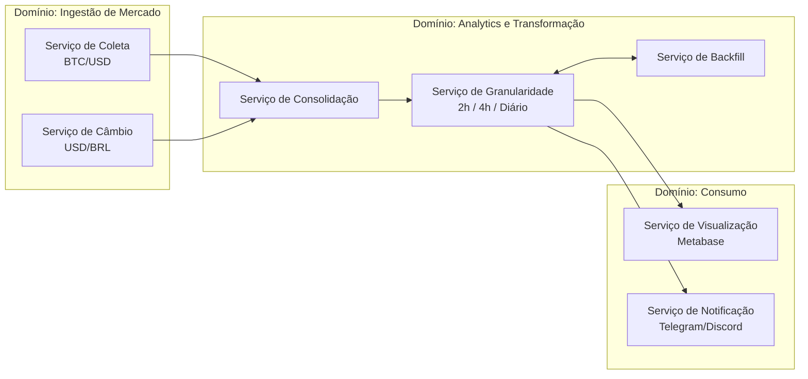

## Domínios e Serviços

### Ingestão de Mercado (Market Intelligence)

Responsável pela coleta de dados externos:

- Serviço de Coleta: Responsável por realizar as requisições à API das exchanges e capturar os dados brutos.

- Serviço de Câmbio: Realiza a coleta diária da paridade USD/BRL para permitir a conversão de valores.
* * *

### Analytics e Transformação

Responsável por:

- Serviço de Consolidação: Cruza os dados de BTC (USD) com a taxa de câmbio (BRL) para gerar o preço em moeda nacional.

- Serviço de Granularidade: Aplica as regras de agregação (médias de 2h, 4h e diária) conforme o tempo de vida do dado.

- Serviço de Backfill: Lógica específica para identificar lacunas no histórico e disparar coletas retroativas.
* * *

### Consumo

Responsável por:

- Serviço de Visualização: Camada que conecta o banco de dados ao Metabase.

- Serviço de Notificação: Envia push, e-mail ou mensagem via bot (Telegram/Discord).
* * *

